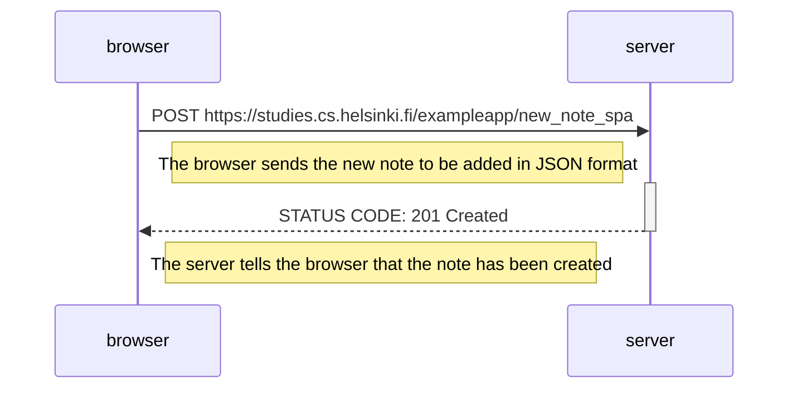

```mermaid
sequenceDiagram
    participant browser
    participant server

    browser->>server: POST https://studies.cs.helsinki.fi/exampleapp/new_note_spa
    Note left of server: The browser sends the new note to be added in JSON format
    activate server
    server-->>browser: STATUS CODE: 201 Created
    deactivate server

    Note right of browser: The server tells the browser that the note has been created
```
